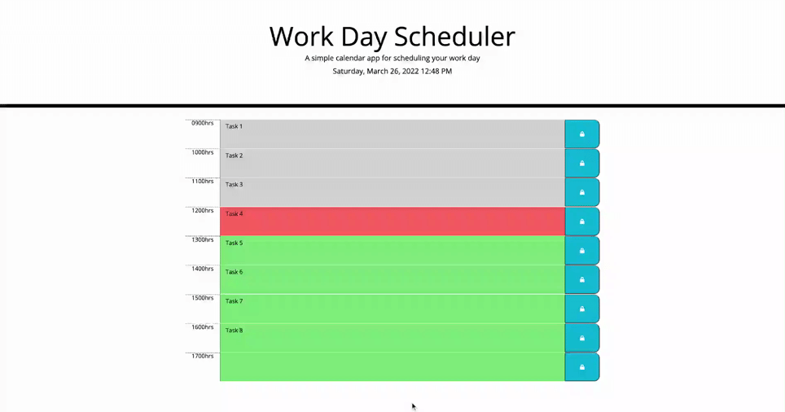

# The 9 to 5 Spot

## Beta Version 0.1

## Features:
Built with HTML, CSS, jQuery, JavaScript, Bootstrap, Iconic, and Moment.js, this daily planner web application will allow you to schedule and keep track of tasks to be completed during your 9am-5pm work day. 

## How to Use:
Clicking the section between the time block and the blue save button will highlight the textbox field that corresponds to the time of your choice. Once you input a pending task for that given time, click on the blue save button directly to the right of it to store your task into the local storage of your computer. To edit a task, simply click on the textbox field you wish to change, make your edits, and click the save button again to store the updated input. 

- When your current time is within the same time block as your task (i.e. your current time is 1330hrs and a task is scheduled to be completed between 1300-1400hrs), the task box will be displayed with a salmon background color.

- When your current time has passed the time block of your task (i.e. your current time is 1330hrs and a task was scheduled to be completed between 1100-1200hrs), the task box will be displayed with a grey background color.

- When your current time is before the time block of an upcoming task (i.e. your current time is 1330hrs and a task is scheduled to be completed between 1500-1600hrs), the task box will be displayed with a lime-green background color.

> Note: Your browser will automatically refresh every 5 minutes. By saving and storing your task, it will continue to display on your computer even after closing your browser, refreshing your screen, or the when the page reloads as scheduled.

## Website:
Vist [The 9 to 5 Spot](https://denysha-abigail.github.io/work-day-scheduler/) to begin planning out your day!

## Preview:

## Credits:
[Xander Rapstine](https://github.com/coding-boot-camp/super-disco)

## Contributors:
*Denysha Guerrios-Armaiz, 03/2022*